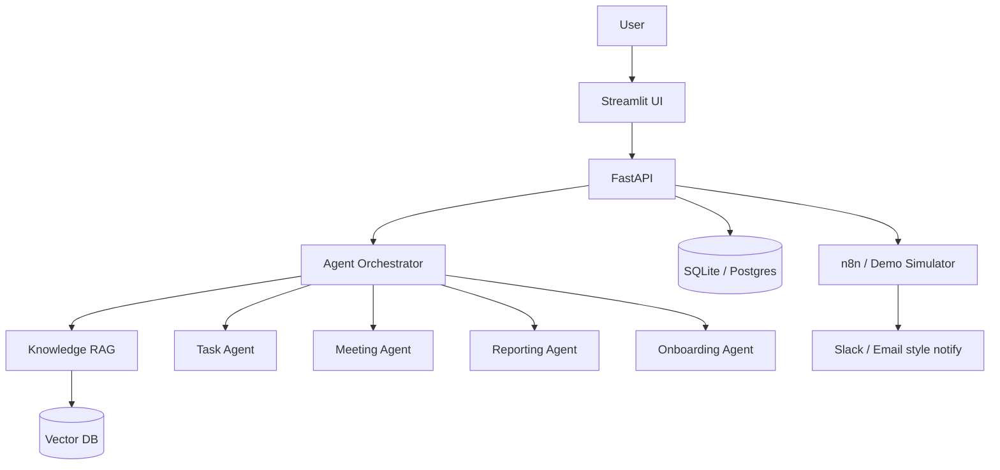

# OpsFlow AI

**Autonomous AI Operations Platform** — a recruiter-ready portfolio demo of LLM agents, RAG, and workflow automation for AI Innovation Engineer, AI Operations, and AI Automation roles.

> **Public demo mode** ships with fictional company data and simulated n8n workflows. No Slack/SMTP credentials required.

---

## Overview

OpsFlow AI helps operations teams eliminate repetitive work:

- Answer policy questions with **RAG + citations**
- Turn chat / meetings into **owned tasks**
- Run **employee onboarding** end-to-end
- Surface **business-impact analytics** (queries, hours saved, success rate)

Built as a production-shaped MVP: FastAPI backend, Streamlit product UI, modular agents, vector retrieval, and automation hooks.

---

## Problem

Operations teams drown in repetitive work — policy lookups, onboarding checklists, meeting follow-ups, and status reporting — while tribal knowledge lives in scattered documents. Manual handoffs to Slack/email create delays and missed owners.

## Solution

OpsFlow AI combines:

1. **Specialist LLM agents** for knowledge, tasks, meetings, reporting, and onboarding  
2. **RAG** over company handbooks/policies with confidence + sources  
3. **Workflow automation** (real n8n or simulated demo mode) for notifications  

---

## Architecture

```
User
  │
Streamlit UI
  │
FastAPI
  │
LangChain Agents  (+ optional LangGraph router)
  │
RAG Pipeline
  │
Vector Database (Chroma / in-memory)
  │
n8n Automation (live or DEMO simulated)
```



---

## AI Agent Workflow

**Example — Employee onboarding**

```
Employee Added
     ↓
Onboarding Agent → welcome email
     ↓
n8n simulation → accounts checklist
     ↓
Task Agent → HR task pack
     ↓
Notification → Slack-style message
```

**Example — Policy question**

```
User question → Knowledge Agent → retrieve chunks → grounded answer + citations + confidence
```

---

## Demo Features

| Feature | What recruiters see |
|---|---|
| **Home** | Product positioning + architecture |
| **AI Operations Assistant** | RAG chat with sources (try annual leave question) |
| **Employee Onboarding Demo** | One-click workflow with email, checklist, tasks, notify |
| **AI Agent Showcase** | Input/output contracts for every agent |
| **Analytics** | 245 queries · 128 tasks · 42 hrs · 96% success (demo baseline) |
| **DEMO_MODE** | Sample docs/employees seeded; n8n simulated |

Sample prompt: *How many annual leave days do employees receive?* → **25 days** from `employee_handbook.txt`.

---

## Technology Stack

- **UI:** Streamlit, Plotly  
- **API:** FastAPI, Pydantic, SQLAlchemy  
- **AI:** LangChain, OpenAI (optional), SentenceTransformers / Chroma  
- **Automation:** n8n webhooks + demo simulator  
- **Deploy:** Docker, Railway/Render-ready `Procfile` + `render.yaml`  

---

## Screenshots

Capture these for GitHub after local run:

1. **Home** — hero + feature grid  
2. **AI Operations Assistant** — answer with citation cards  
3. **Onboarding Demo** — pipeline steps + welcome email  
4. **Analytics** — KPI row + charts  
5. **Agent Showcase** — agent cards  

---

## Local Setup

```bash
python -m venv .venv
# Windows: .venv\Scripts\activate
source .venv/bin/activate

pip install -r requirements.txt
copy .env.example .env   # set ADMIN_PASSWORD; optional OPENAI_API_KEY

uvicorn backend.main:app --reload --port 8000
streamlit run frontend/streamlit_app.py
```

| URL | Purpose |
|---|---|
| http://localhost:8501 | Demo UI |
| http://localhost:8000/docs | API |

Default user: `admin` / value of `ADMIN_PASSWORD` in `.env`.

### Demo checklist

1. Open **Home** — confirm DEMO MODE banner  
2. **AI Operations Assistant** — ask the annual leave question  
3. **Employee Onboarding Demo** — run one-click workflow  
4. **Analytics Dashboard** — review KPIs  

---

## Deployment Guide

### Docker Compose (full stack)

```bash
copy .env.example .env
docker compose up --build
```

### Railway

1. New project → Deploy from GitHub repo  
2. Set env: `DEMO_MODE=true`, `VECTOR_STORE=memory`, `N8N_ENABLED=false`, `SECRET_KEY`, `ADMIN_PASSWORD`  
3. Optional: `OPENAI_API_KEY`  
4. Health check: `/api/v1/health`  

### Render

Use `render.yaml`, set `OPENAI_API_KEY` in the dashboard, deploy.

### Production hardening

```
DEMO_MODE=false
DEMO_AUTH_BYPASS=false
N8N_ENABLED=true
VECTOR_STORE=chroma
APP_DEBUG=false
```

---

## Demo Safety

- No real company data in `demo_data/`  
- No Slack/SMTP required when `DEMO_MODE=true`  
- Secrets only via environment variables  
- UI does not embed API keys or default production passwords  

---

## Project structure

```
frontend/          Streamlit product UI
backend/           FastAPI + agents + RAG + demo seed
demo_data/         Handbook, policy PDF, transcript, sample tasks
automation/        n8n workflow JSON
tests/             Pytest suite
```

---

## License

MIT — see [LICENSE](LICENSE).
