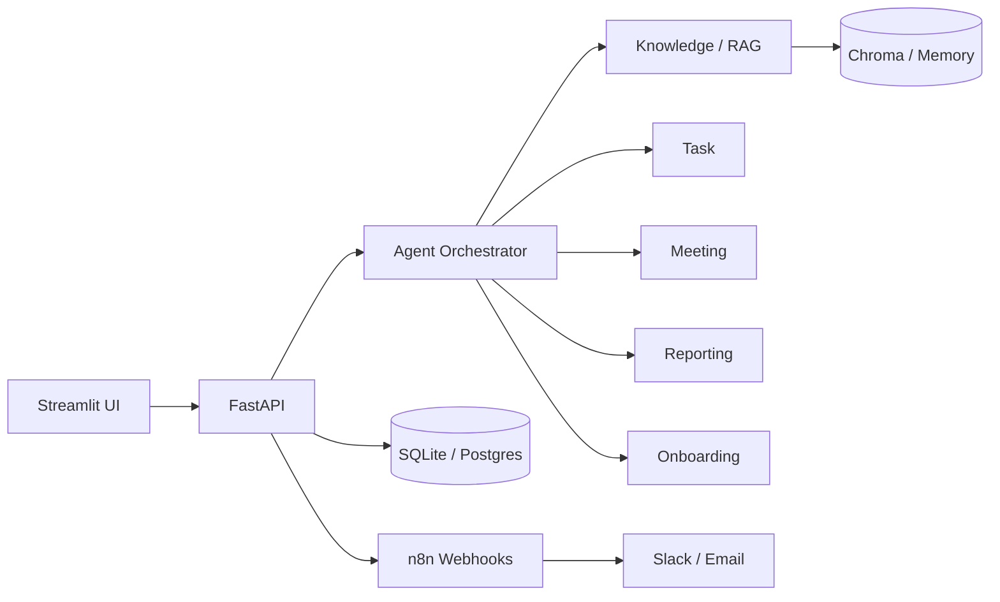

# OpsFlow AI

AI-first **Operations Automation Platform** for enterprise knowledge retrieval, task automation, meeting intelligence, employee onboarding, and workflow orchestration.

Built as a portfolio-quality system for AI Innovation Engineer / AI Operations roles — combining **RAG**, **multi-agent orchestration (LangChain)**, **FastAPI**, **Streamlit**, and **n8n**.

---

## Features

| Capability | Description |
|---|---|
| **Knowledge Agent (RAG)** | Q&A over company PDFs/DOCX/TXT with citations + confidence |
| **Task Agent** | Natural language → structured tasks (title, priority, owner, deadline) |
| **Meeting Agent** | Transcript → summary, decisions, action items → tasks |
| **Reporting Agent** | Weekly ops reports with bottlenecks and trends |
| **Onboarding Agent** | New hire → welcome email → accounts checklist → HR tasks → Slack |
| **Conversation history** | Persisted chats with agent metadata and citations |
| **Analytics** | Queries solved, estimated hours saved, common request types |
| **n8n automation** | Email/task/document/meeting/onboarding webhooks |

---

## Architecture



### Knowledge Agent workflow

1. User question enters the orchestrator  
2. Intent routed to Knowledge Agent  
3. Query embedded → top-k chunks retrieved  
4. Chunks filtered by similarity threshold (no weak matches)  
5. LLM answers grounded only in retrieved context (offline excerpt mode without API key)  
6. Confidence + citations returned to the UI  

---

## Quick start (local)

### Prerequisites

- Python 3.10+
- OpenAI API key *(optional — offline heuristics still work)*

### Setup

```bash
python -m venv .venv

# Windows
.venv\Scripts\activate

# macOS / Linux
source .venv/bin/activate

pip install -r requirements.txt
copy .env.example .env   # Windows
# cp .env.example .env   # macOS / Linux
```

Edit `.env`:

```
OPENAI_API_KEY=sk-...          # optional
VECTOR_STORE=memory            # or chroma for full RAG
DEMO_AUTH_BYPASS=true          # local demos only
N8N_ENABLED=false
```

### Run

```bash
uvicorn backend.main:app --reload --host 0.0.0.0 --port 8000
streamlit run frontend/streamlit_app.py
```

| Service | URL |
|---|---|
| API docs | http://localhost:8000/docs |
| Streamlit UI | http://localhost:8501 |

Default login: `admin` / value of `ADMIN_PASSWORD` in `.env`

### Try it

1. **Document Upload** → upload `documents/sample_ops_policy.txt`  
2. **Chat** → *“How quickly must production incidents be acknowledged?”*  
3. **Employee Onboarding** → add a new hire and watch the 5-step pipeline  

---

## Docker

```bash
copy .env.example .env
docker compose up --build
```

| Service | URL |
|---|---|
| Backend | http://localhost:8000 |
| Streamlit | http://localhost:8501 |
| n8n | http://localhost:5678 |

Compose sets `N8N_WEBHOOK_BASE_URL=http://n8n:5678/webhook` and disables demo auth bypass.

Import workflows from `automation/n8n_workflows/` into n8n.

---

## API overview

| Method | Endpoint | Purpose |
|---|---|---|
| `POST` | `/api/v1/auth/login` | JWT login |
| `POST` | `/api/v1/chat` | Orchestrated Operations AI chat |
| `GET` | `/api/v1/chat/conversations` | Conversation history |
| `POST` | `/api/v1/documents/upload` | Upload + RAG index |
| `GET/POST/PATCH` | `/api/v1/tasks` | Task management |
| `POST` | `/api/v1/tasks/extract` | NL → tasks |
| `POST` | `/api/v1/meetings/summarise` | Meeting intelligence |
| `POST` | `/api/v1/onboarding/employees` | New-hire automation pipeline |
| `POST` | `/api/v1/reports/generate` | Weekly ops report |
| `GET` | `/api/v1/analytics` | KPI dashboard data |
| `GET` | `/api/v1/health` | Health + vector backend + LLM status |

---

## Security

- Secrets via environment variables (`.env` never committed)
- JWT bearer authentication (`python-jose` + `bcrypt`)
- `DEMO_AUTH_BYPASS` for local Streamlit demos only — **disable in production**
- Upload validation (extension allow-list, size limit, safe filenames)
- Pydantic request validation on write endpoints
- Automation webhook failures are non-blocking

---

## Testing

```bash
pytest -q
```

---

## Project structure

```
├── frontend/                 # Streamlit dashboard (7 pages)
├── backend/
│   ├── api/                  # REST routers
│   ├── agents/               # Knowledge, Task, Meeting, Reporting, Onboarding
│   ├── rag/                  # Loaders, chunking, vector store, pipeline
│   ├── database/             # SQLAlchemy session
│   ├── models/               # ORM + Pydantic schemas
│   ├── services/             # Business logic + n8n hooks
│   └── core/                 # Config, security, deps
├── automation/n8n_workflows/ # Importable n8n JSON
├── documents/                # Uploads + sample policies
├── tests/
├── requirements.txt
├── docker-compose.yml
└── README.md
```

---

## License

MIT — see [LICENSE](LICENSE). Built for educational / portfolio demonstration.
