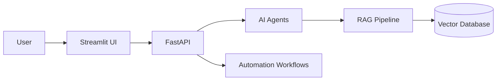

# OpsFlow AI

**Autonomous AI Operations Platform**

An AI-powered operations assistant that combines **LLM agents**, **Retrieval-Augmented Generation (RAG)**, and **workflow automation** to make business processes faster and smarter.

Built during an MSc Artificial Intelligence journey to apply AI beyond traditional models — targeting roles in **AI Innovation**, **AI Automation**, and intelligent business systems.

---

## Overview

Operations teams spend valuable time on repetitive work: searching documents, answering common questions, managing onboarding, and coordinating tasks across platforms.

OpsFlow AI addresses that with specialist agents, document intelligence, and automation hooks.

---

## Problem

- Policy and handbook knowledge is scattered across files  
- Meeting follow-ups rarely become owned tasks  
- Onboarding requires manual emails, checklists, and HR coordination  
- Teams lack clear visibility into automation impact  

## Solution

OpsFlow AI provides:

1. **Specialist LLM agents** — Knowledge, Task, Meeting, Reporting, Onboarding  
2. **RAG** over company documents with citations and confidence scores  
3. **Workflow automation** via n8n (or simulated demo mode without Slack/SMTP credentials)  

---

## Key capabilities

| Capability | What it does |
|---|---|
| **Knowledge Q&A (RAG)** | Answers company policy questions with document citations |
| **Task automation** | Converts conversations and meeting notes into structured tasks with priorities and owners |
| **Employee onboarding** | Welcome email → accounts checklist → HR tasks → notification |
| **Meeting intelligence** | Summary, key decisions, and action items |
| **Operational analytics** | Queries solved, tasks created, estimated hours saved |

**Try this demo prompt:** *How many annual leave days do employees receive?*  
→ Answer grounded in `demo_data/employee_handbook.txt` (**25 days**) with citations.

---

## Technology stack

**Python · FastAPI · Streamlit · LangChain · LangGraph · RAG · ChromaDB · SQLAlchemy · n8n Automation · Docker**

| Layer | Tools |
|---|---|
| UI | Streamlit, Plotly |
| API | FastAPI, Pydantic, SQLAlchemy |
| AI | LangChain agents, optional LangGraph router, OpenAI (optional offline heuristics) |
| RAG | Text chunking, embeddings, ChromaDB / in-memory vector store |
| Automation | n8n webhooks + DEMO_MODE simulator |
| Deploy | Docker, Procfile, render.yaml |

---

## High-level architecture

Matches the product story shared publicly:

```
User → AI Interface → FastAPI → AI Agents → RAG Pipeline → Vector Database → Automation Workflows
```

```
User
  │
Streamlit UI
  │
FastAPI
  │
AI Agents (LangChain / LangGraph)
  │
RAG Pipeline
  │
Vector Database (Chroma / memory)
  │
n8n Automation (live or DEMO simulated)
```



---

## AI agent workflow

### Employee onboarding

```
Employee Added
     ↓
AI Agent (welcome email)
     ↓
n8n Workflow (accounts checklist)
     ↓
Task Agent (HR tasks)
     ↓
Notification (Slack-style message)
```

### Policy question

```
User question → Knowledge Agent → retrieve chunks → grounded answer + citations + confidence
```

### Agents in the codebase

| Agent | Module | Responsibility |
|---|---|---|
| Knowledge | `backend/agents/knowledge_agent.py` | Document search + RAG answers |
| Task | `backend/agents/task_agent.py` | Structured operational tasks |
| Meeting | `backend/agents/meeting_agent.py` | Summaries + action items |
| Reporting | `backend/agents/reporting_agent.py` | Ops insights / weekly reports |
| Onboarding | `backend/agents/onboarding_agent.py` | Welcome email + checklist |

Orchestration: `backend/agents/orchestrator.py` (LangChain routing; optional LangGraph graph helper).

---

## Streamlit product UI

Launch: `streamlit run frontend/streamlit_app.py`

| Page | Purpose |
|---|---|
| Chat with Operations AI | RAG Q&A with citations and confidence |
| Document Upload | Index PDF / DOCX / TXT into the knowledge base |
| Task Management | Create, update, and track operational tasks |
| Meeting Summarisation | Transcript → summary, decisions, tasks |
| Employee Onboarding | New-hire pipeline demo |
| Analytics Dashboard | Automation impact metrics |
| System Settings | Runtime config (secrets stay in `.env`) |

---

## Demo mode

With `DEMO_MODE=true` (default in `.env.example`):

- Loads fictional **OpsFlow Technologies** sample documents from `demo_data/`
- Seeds sample tasks / employees
- Simulates n8n workflows (no real Slack/email credentials required)
- Keeps API keys in environment variables only

---

## Project structure

```
frontend/                 Streamlit AI interface
backend/
  api/                    FastAPI routes
  agents/                 LLM agents + orchestrator
  rag/                    RAG pipeline + vector store
  services/               Business logic + n8n hooks
  demo/                   Public demo seeding
demo_data/                Handbook, policy, transcript, sample tasks
automation/n8n_workflows/ Importable n8n JSON
tests/                    Pytest suite
```

---

## Local setup

```bash
python -m venv .venv
# Windows
.venv\Scripts\activate
# macOS / Linux
source .venv/bin/activate

pip install -r requirements.txt
copy .env.example .env

uvicorn backend.main:app --reload --port 8000
streamlit run frontend/streamlit_app.py
```

| Service | URL |
|---|---|
| Streamlit UI | http://localhost:8501 |
| API docs | http://localhost:8000/docs |
| Health | http://localhost:8000/api/v1/health |

Login: `admin` / value of `ADMIN_PASSWORD` in `.env` (never hardcode secrets in the UI).

---

## Deployment

```bash
docker compose up --build
```

Also ready for Railway / Render (`Procfile`, `render.yaml`, Docker `PORT` support).

Production checklist:

```
DEMO_MODE=false
DEMO_AUTH_BYPASS=false
N8N_ENABLED=true
VECTOR_STORE=chroma
APP_DEBUG=false
SECRET_KEY=<strong-random>
ADMIN_PASSWORD=<strong-password>
```

---

## Safety

- No real company data in `demo_data/`  
- Demo workflows do not require Slack/SMTP  
- Secrets via environment variables only  
- `.env` is gitignored  

---

## License

MIT — see [LICENSE](LICENSE).
